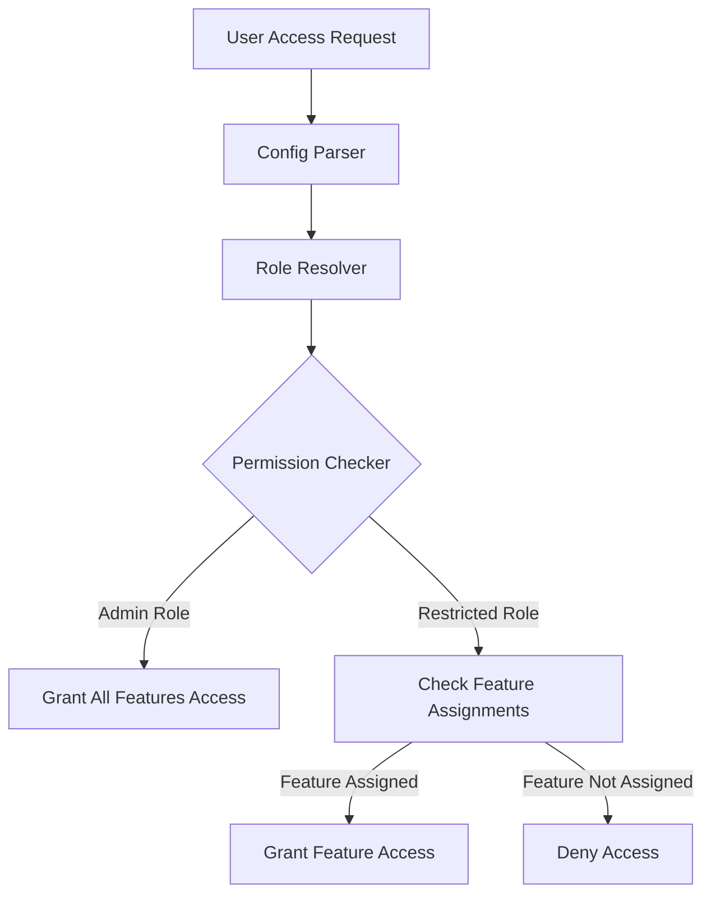

# Design Document

## Overview

This design specifies a simple role-based permission system for the admin dashboard that extends the existing email-based access control. The system introduces two roles: admin (full access to all features) and restricted (access only to assigned features). The implementation maintains backward compatibility with the existing ALLOWED_EMAILS environment variable by extending its format to include role and feature assignments.

The design prioritizes simplicity while providing the necessary flexibility for access control. The system consists of a configuration parser, role definitions, and a permission checker that enforces access control based on user roles and feature assignments.

## Architecture

The permission system follows a straightforward layered architecture with three main components:

1. **Configuration Layer**: Parses and validates the ALLOWED_EMAILS environment variable
2. **Role Layer**: Defines roles and their associated permissions
3. **Enforcement Layer**: Checks and enforces access control decisions

The system operates as follows: when a user attempts to access the admin dashboard, the configuration layer parses their entry from the environment variable, the role layer determines their access level, and the enforcement layer grants or denies access to specific features based on their role and assignments.



## Components and Interfaces

### PermissionConfig

The PermissionConfig component parses and validates the ALLOWED_EMAILS environment variable. It handles the extended format that includes role and feature assignments.

**Responsibilities:**
- Parse the ALLOWED_EMAILS environment variable
- Validate the format of each entry
- Extract email, role, and feature assignments from each entry
- Provide access to parsed user configurations

**Interface:**
```typescript
interface PermissionConfig {
  parse(): UserPermission[];
  validate(): ValidationResult;
  getAvailableFeatures(): string[];
}
```

### Role

The Role component defines the available roles and their default behaviors. It provides constants and validation for role types.

**Responsibilities:**
- Define role constants (ADMIN, RESTRICTED)
- Validate role values
- Provide role-based default permissions

**Interface:**
```typescript
enum Role {
  ADMIN = 'admin',
  RESTRICTED = 'restricted'
}

interface RoleConfig {
  isAdmin(role: Role): boolean;
  getDefaultFeatures(role: Role): string[];
}
```

### PermissionChecker

The PermissionChecker component enforces access control based on user permissions and requested features. It is the main entry point for permission checks.

**Responsibilities:**
- Check if a user can access the admin dashboard
- Check if a user can access a specific feature
- Handle admin role (all access) and restricted role (specific access)
- Provide clear access control decisions

**Interface:**
```typescript
class PermissionChecker {
  constructor(config: PermissionConfig);
  canAccessDashboard(email: string): boolean;
  canAccessFeature(email: string, featureName: string): boolean;
  getAccessibleFeatures(email: string): string[];
}
```

### UserPermission

The UserPermission data structure represents a user's permission configuration parsed from the environment variable.

**Structure:**
```typescript
interface UserPermission {
  email: string;
  role: Role;
  assignedFeatures: string[];
}
```

## Data Models

### Environment Variable Format

The ALLOWED_EMAILS environment variable uses a semicolon-separated list of user entries. Each entry follows one of these formats:

- `email` - User with restricted role, no features assigned
- `email:role` - User with specified role, no features assigned
- `email:role:feature1,feature2,feature3` - User with specified role and feature assignments

**Examples:**
```
admin@example.com:admin;manager@example.com:restricted:dashboard,members;viewer@example.com:restricted:dashboard
```

In this example:
- admin@example.com has admin role and can access all features
- manager@example.com has restricted role and can only access dashboard and members features
- viewer@example.com has restricted role (default) and can access only the dashboard feature (default)

### Feature Configuration

Features represent the specific tabs and functionality available in the admin dashboard. Each feature maps to a distinct section or capability that users can access based on their role assignments.

**Default Feature Names:**
- dashboard
- members
- payments
- articles
- settings

The feature configuration can be extended through environment variables or configuration files for flexibility.

### Validation Rules

The system enforces the following validation rules:

1. Email format must be valid
2. Role must be either "admin" or "restricted"
3. Feature names must exist in the available features list
4. Duplicate email entries are not allowed
5. Empty environment variable is valid (no users allowed)

## Correctness Properties

A property is a characteristic or behavior that should hold true across all valid executions of a system—essentially, a formal statement about what the system should do. Properties serve as the bridge between human-readable specifications and machine-verifiable correctness guarantees.

### Acceptance Criteria Testing Prework

1.1. THE Permission_System SHALL support an "admin" role that grants access to all features in the admin dashboard
  Thoughts: This is testing that the role system correctly identifies admin users. We can generate random users with admin role and verify they can access all available features.
  Testable: yes - property

1.2. THE Permission_System SHALL support a "restricted" role that grants access only to specific features in the admin dashboard
  Thoughts: This is testing that restricted users can only access their assigned features. We can generate random restricted users with specific feature assignments and verify they can only access those features.
  Testable: yes - property

1.3. WHERE a user has the admin role, THE Permission_System SHALL grant access to all admin dashboard features without restriction
  Thoughts: This is testing that admin users have unrestricted access. We can generate random admin users and verify they can access all features regardless of feature configuration.
  Testable: yes - property

1.4. WHERE a user has the restricted role, THE Permission_System SHALL grant access only to features explicitly assigned to that user
  Thoughts: This is testing that restricted users cannot access unassigned features. We can generate random restricted users with specific assignments and verify they cannot access features not in their assignment list.
  Testable: yes - property

2.1. THE Permission_System SHALL continue using the existing ALLOWED_EMAILS environment variable for user authentication
  Thoughts: This is testing backward compatibility. We can verify that the system correctly parses the existing email-only format.
  Testable: yes - property

2.2. WHEN a user attempts to access the admin dashboard, THE Permission_System SHALL verify their email is in the allowed list
  Thoughts: This is testing that users not in the allowed list are denied access. We can generate random emails not in the allowed list and verify they are denied access.
  Testable: yes - property

2.3. THE Permission_System SHALL parse role assignments from the ALLOWED_EMAILS environment variable using a defined format
  Thoughts: This is testing that the parser correctly handles the extended format. We can generate random valid format strings and verify they are parsed correctly.
  Testable: yes - property

2.4. WHERE the environment variable format is invalid, THE Permission_System SHALL log an error and deny access to all users
  Thoughts: This is testing error handling for invalid formats. We can generate invalid format strings and verify the system logs errors and denies access.
  Testable: yes - property

3.1. THE Permission_System SHALL support the format "email:role" for assigning roles to individual users
  Thoughts: This is testing that the parser correctly handles the email:role format. We can generate random email:role strings and verify they are parsed correctly.
  Testable: yes - property

3.2. THE Permission_System SHALL support the format "email:role:feature1,feature2" for assigning roles with specific feature access
  Thoughts: This is testing that the parser correctly handles the email:role:features format. We can generate random valid format strings and verify they are parsed correctly.
  Testable: yes - property

3.3. WHERE no role is specified for a user, THE Permission_System SHALL default to the restricted role
  Thoughts: This is testing the default role behavior. We can generate email-only entries and verify they are assigned the restricted role.
  Testable: yes - property

3.4. WHERE no features are specified for a restricted user, THE Permission_System SHALL grant access to no features by default
  Thoughts: This is testing the default feature behavior for restricted users. We can generate restricted users without feature assignments and verify they have no feature access.
  Testable: yes - property

4.1. WHEN a user with the admin role attempts to access any feature, THE Permission_System SHALL allow access
  Thoughts: This is testing admin access to any feature. We can generate random admin users and random features and verify access is always allowed.
  Testable: yes - property

4.2. WHEN a user with the restricted role attempts to access an assigned feature, THE Permission_System SHALL allow access
  Thoughts: This is testing restricted user access to assigned features. We can generate random restricted users with specific assignments and verify they can access their assigned features.
  Testable: yes - property

4.3. WHEN a user with the restricted role attempts to access an unassigned feature, THE Permission_System SHALL deny access
  Thoughts: This is testing restricted user denial for unassigned features. We can generate random restricted users with specific assignments and verify they cannot access unassigned features.
  Testable: yes - property

4.4. WHEN access is denied, THE Permission_System SHALL return an appropriate error response
  Thoughts: This is testing that denied access returns an error. We can verify that denied access attempts return an error response.
  Testable: yes - property

5.1. THE Permission_System SHALL define a configurable list of available features in the admin dashboard
  Thoughts: This is testing that the system has a configurable feature list. We can verify that the feature configuration can be set and retrieved.
  Testable: yes - property

5.2. THE Permission_System SHALL validate that restricted user feature assignments reference valid feature names
  Thoughts: This is testing that invalid feature assignments are detected. We can generate restricted users with invalid feature names and verify they are flagged as invalid.
  Testable: yes - property

5.3. WHERE a restricted user is assigned a non-existent feature, THE Permission_System SHALL log a warning and ignore the invalid assignment
  Thoughts: This is testing error handling for invalid feature assignments. We can generate restricted users with invalid feature names and verify warnings are logged and access is denied for invalid features.
  Testable: yes - property

### Property Reflection

After reviewing the properties identified in the prework, I can see several opportunities for consolidation:

- Properties 1.1, 1.3, and 4.1 all test admin user access to features - these can be combined
- Properties 1.2, 1.4, 4.2, and 4.3 all test restricted user access patterns - these can be combined
- Properties 2.1 and 2.3 test parsing behavior - these can be combined
- Properties 3.1, 3.2, and 3.3 test format parsing and defaults - these can be combined
- Properties 5.2 and 5.3 test invalid feature handling - these can be combined

### Correctness Properties

Property 1: Admin users have unrestricted feature access
*For any* admin user and *for any* available feature, the permission checker shall grant access to that feature
**Validates: Requirements 1.1, 1.3, 4.1**

Property 2: Restricted users have limited feature access
*For any* restricted user with assigned features and *for any* feature in their assignment list, the permission checker shall grant access to that feature, and *for any* feature not in their assignment list, the permission checker shall deny access
**Validates: Requirements 1.2, 1.4, 4.2, 4.3**

Property 3: Environment variable parsing preserves configuration
*For any* valid environment variable string, parsing it shall produce a list of user permissions where each permission has the correct email, role, and feature assignments as specified in the string
**Validates: Requirements 2.1, 2.3, 3.1, 3.2, 3.3**

Property 4: Default role and feature assignments
*For any* user entry without a role specified, the role shall default to restricted, and *for any* restricted user without feature assignments, the assigned features shall be empty
**Validates: Requirements 3.3, 3.4**

Property 5: Invalid format handling
*For any* invalid environment variable format, the system shall log an error and deny access to all users
**Validates: Requirements 2.4**

Property 6: Feature validation prevents invalid assignments
*For any* restricted user with feature assignments, all assigned features shall exist in the available features list, and *for any* assigned feature that does not exist, the system shall log a warning and not grant access to that feature
**Validates: Requirements 5.2, 5.3**

Property 7: Access denial returns error response
*For any* access denial scenario, the permission checker shall return an error response indicating access was denied
**Validates: Requirements 4.4**

## Error Handling

The system handles errors through a combination of logging and access denial. Invalid configurations result in logged warnings or errors, while invalid access attempts result in denied access with appropriate error responses.

**Configuration Errors:**
- Invalid email format: Log warning, skip invalid entry
- Invalid role value: Log error, default to restricted role
- Invalid feature name: Log warning, ignore invalid feature assignment
- Completely invalid format: Log error, deny all access

**Access Errors:**
- User not in allowed list: Deny access, return unauthorized error
- Restricted user accessing unassigned feature: Deny access, return forbidden error
- Admin user accessing any feature: Always allow, no error

**Error Response Format:**
```typescript
interface AccessError {
  code: 'UNAUTHORIZED' | 'FORBIDDEN';
  message: string;
  details?: {
    email?: string;
    requestedFeature?: string;
    availableFeatures?: string[];
  };
}
```

## Testing Strategy

The testing strategy employs a dual approach combining unit tests for specific examples and edge cases with property-based tests for universal correctness properties.

### Unit Testing

Unit tests shall cover:
- Parsing each format variant (email only, email:role, email:role:features)
- Default role and feature assignments
- Error handling for invalid formats
- Specific access control scenarios
- Feature validation edge cases

### Property-Based Testing

Property-based tests shall validate the correctness properties identified in the design. Each property shall be implemented as a property-based test using a suitable testing library.

**Library Selection:** For TypeScript/JavaScript implementations, the fast-check library is recommended for property-based testing. For Python implementations, the Hypothesis library is recommended.

**Test Configuration:**
- Minimum 100 iterations per property test
- Each property test tagged with feature and property references
- Custom generators for emails, roles, and feature names

**Property Test Mapping:**

| Property | Unit Test Coverage | Property Test Coverage |
|----------|-------------------|----------------------|
| Property 1 | Admin access to specific features | Admin access to all features across iterations |
| Property 2 | Specific restricted user scenarios | Universal restricted access patterns |
| Property 3 | Valid format parsing | Format parsing across all valid inputs |
| Property 4 | Default assignment scenarios | Default behavior across all cases |
| Property 5 | Invalid format handling | Error handling across all invalid inputs |
| Property 6 | Invalid feature scenarios | Feature validation across all assignments |
| Property 7 | Error response format | Error responses across all denial scenarios |

**Test Tag Format:**
```typescript
// Feature: admin-role-permissions, Property 1: Admin users have unrestricted feature access
```

### Integration Testing

Integration tests shall verify:
- End-to-end access control flow
- Environment variable parsing integration
- Error handling integration
- Configuration validation integration