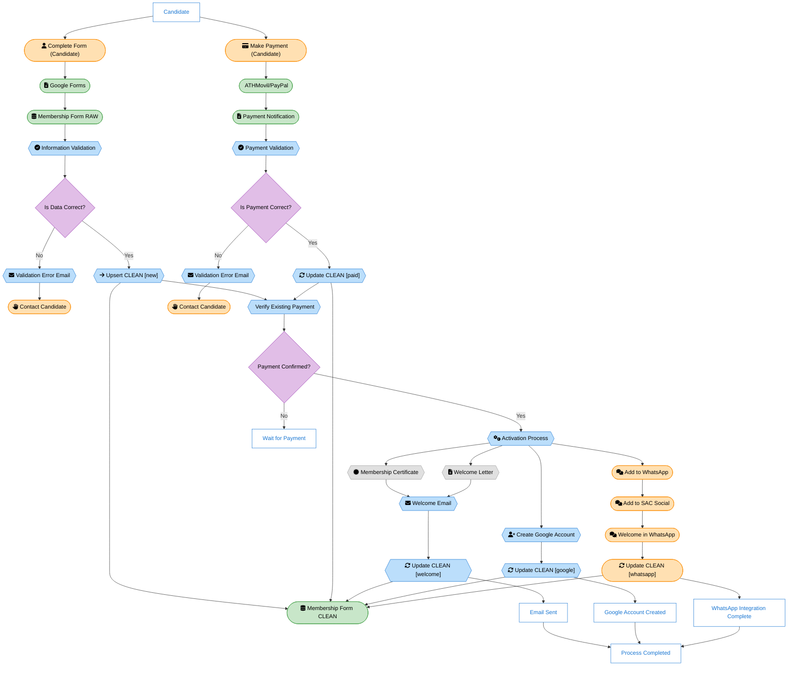

# New Member Onboarding Process

## Overview

This document describes the process for onboarding new members to the Caribbean Astronomy Society (SAC).

| Symbol                                                                                                                   | Description       |
| ------------------------------------------------------------------------------------------------------------------------ | ----------------- |
| <svg width="40" height="40"><rect x="5" y="10" width="30" height="30" rx="0" fill="#FFFFFF" stroke="#1976D2"/></svg>     | State or Entity   |
| <svg width="40" height="40"><rect x="5" y="10" width="30" height="30" rx="15" fill="#FFE0B2" stroke="#FB8C00"/></svg>    | Manual Process    |
| <svg width="40" height="40"><rect x="5" y="10" width="30" height="30" rx="15" fill="#C8E6C9" stroke="#43A047"/></svg>    | Automatic Process |
| <svg width="40" height="40"><polygon points="5,25 12,15 28,15 35,25 28,35 12,35" fill="#BBDEFB" stroke="#1976D2"/></svg> | Script            |
| <svg width="40" height="40"><polygon points="20,15 35,25 20,35 5,25" fill="#E1BEE7" stroke="#8E24AA"/></svg>             | Decision          |
| <svg width="40" height="40"><polygon points="5,25 12,15 28,15 35,25 28,35 12,35" fill="#E0E0E0" stroke="#9E9E9E"/></svg> | To Be Refined     |

