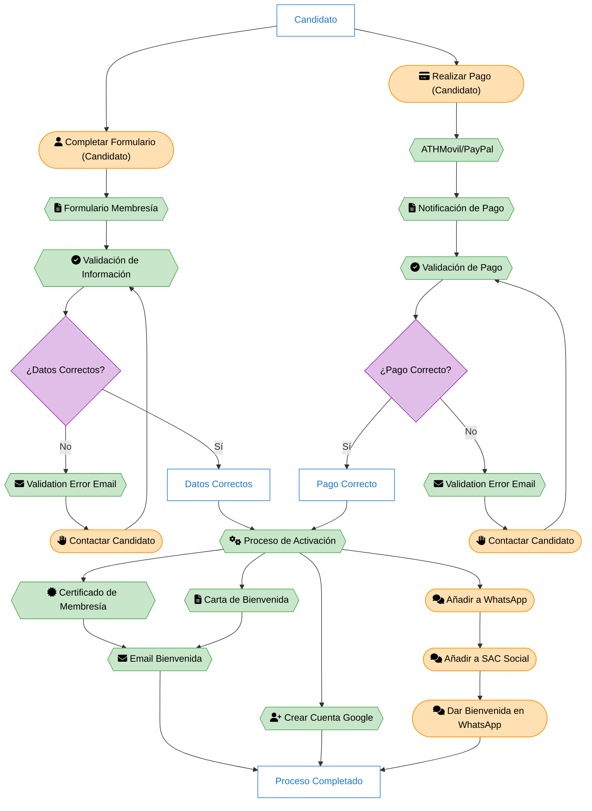

# Proceso de Incorporación de Nuevos Miembros

## Descripción General

Este documento describe el proceso de incorporación de nuevos miembros a la Sociedad de Astronomía del Caribe (SAC).

| Símbolo                                                                                                                  | Descripción        |
| ------------------------------------------------------------------------------------------------------------------------ | ------------------ |
| <svg width="40" height="40"><rect x="5" y="10" width="30" height="30" rx="0" fill="#FFFFFF" stroke="#1976D2"/></svg>     | Estado o Entidad   |
| <svg width="40" height="40"><rect x="5" y="10" width="30" height="30" rx="15" fill="#FFE0B2" stroke="#FB8C00"/></svg>    | Proceso Manual     |
| <svg width="40" height="40"><polygon points="5,25 12,15 28,15 35,25 28,35 12,35" fill="#C8E6C9" stroke="#43A047"/></svg> | Proceso Automático |
| <svg width="40" height="40"><polygon points="20,15 35,25 20,35 5,25" fill="#E1BEE7" stroke="#8E24AA"/></svg>             | Decisión           |

### 1. Solicitud Inicial

- El candidato completa el formulario de membresía en Google Forms
- La información se almacena automáticamente en una hoja de cálculo de Google
- El sistema envía una notificación por correo electrónico

### 2. Pago de Membresía

- El candidato realiza el pago a través de:
  - ATHMovil
  - PayPal
- La plataforma de pago envía una notificación por correo electrónico

### 3. Validación de Información

- Se requiere validar la información del formulario
- Se verifica que los datos estén completos y sean correctos
- En caso de inconsistencias:
  - Se debe contactar al candidato para aclaraciones
  - Se actualiza la información en la hoja de cálculo limpia

### 4. Validación de Pago

- Se requiere verificar:
  - La recepción del pago
  - Que el monto sea correcto
- Se marca el estado como "pagado" en la hoja de cálculo limpia

### 5. Proceso de Activación

Una vez validados tanto el perfil como el pago, se procede con:

#### 5.1 Envío de Documentación

- Se genera y envía correo electrónico de bienvenida que incluye:
  - Certificado de Membresía (generado)
  - Carta de Bienvenida (generada)
  - Calendario del mes actual (estático)

#### 5.2 Creación de Cuenta Institucional

- Se genera cuenta de Google Workspace
- Formato del correo: nombre.apellido@sociedadastronomia.com

#### 5.3 Integración a Grupos de Comunicación

- Se añade al nuevo miembro al grupo de WhatsApp de la comunidad
- Se incorpora al miembro al canal SAC Social
- Se envía mensaje de bienvenida en el canal SAC Social
