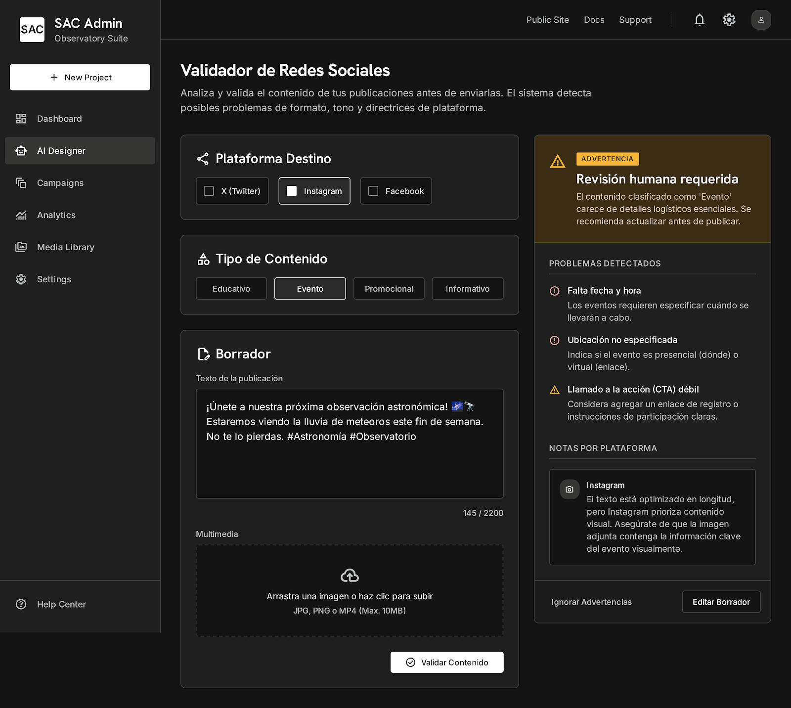
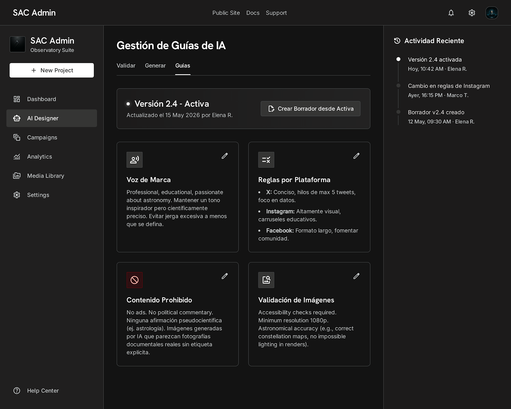

# AI Social Media Designer

**Document type:** Product Requirements Document  
**Working product name:** AI Social Media Designer  
**Audience:** Engineering contributors  
**Status:** Draft for review

---

## Scope commitment (read first)

| Item | MVP decision |
|------|----------------|
| **Audience** | Admin and authorized communications users only (`/admin/ai`). Member-facing access is out of scope for MVP. |
| **Committed MVP scope** | **Phase 1: Validation agent** (text and image validation) and **Phase 2: Generation agent** (text and image generation for posts), delivered incrementally. |
| **Publishing** | No automatic posting or scheduling. Users copy or download outputs and publish manually outside the dashboard. |
| **RAG and video** | Future phases only. |
| **Guideline management UI** | Included in Phase 1C so authorized communications users can maintain active guidelines. |

---

## Executive summary

SAC needs **AI Social Media Designer**, an AI-assisted admin dashboard feature that helps the communications team create, validate, and improve social media content before publication. The feature supports two workflows: **validating** proposed posts and **generating** draft posts for X, Instagram, and Facebook.

The MVP is guideline-driven, human-in-the-loop, and includes both validation and generation workflows. Phase 1 validates text plus uploaded images and includes guideline management. Phase 2 generates post text and images. The dashboard does not publish to social platforms; users copy or download generated outputs and take them to the platform or workflow where they need them. Future phases may add RAG over historical SAC posts, video validation, and analytics.

---

## Product mockups

These mockups illustrate the intended MVP dashboard experience for stakeholder review. Final UI details may adjust during implementation while preserving the workflows and scope defined in this PRD.

### Validation workflow



### Guideline management workflow



---

## Problem statement

SAC must publish timely, accurate, and platform-appropriate content across multiple channels. Today, quality depends on manual review and informal institutional knowledge that is hard for volunteers to apply consistently.

**Risk:** Off-brand tone, incomplete event details, overconfident astronomy claims, privacy leaks, and repeated revision cycles.

**Solution:** An AI workspace that helps communications users draft and validate content against SAC guidelines, with final approval and publishing remaining human responsibilities.

---

## Goals and success metrics

### Goals

- Validate social media drafts before publication.
- Generate editable first drafts and post images from intent, topic, or event details.
- Support X, Instagram, and Facebook with platform- and content-type-aware rules.
- Apply SAC communication guidelines as the primary source of brand voice.
- Preserve human review before any publication.
- Provide copy/download outputs that users can move into their existing publishing workflow.
- Deliver a realistic MVP with both the validator and generator functioning at minimum.

### Success metrics (review targets)

| Metric | Baseline | Target |
|--------|----------|--------|
| Revision cycles per post | Measure during Phase 0 | Reduce |
| Time from idea to review-ready draft | Measure during Phase 0 | Reduce |
| Communications lead confidence in draft quality | Qualitative survey | Improve |

**MVP quality gates (engineering):**

- ≥90% structured output validity on curated test set.
- ≥85% expected validation outcomes on curated cases.
- ≥85% expected image validation outcomes on curated image cases.
- ≥90% preservation of user-provided facts in generation (Phase 2).
- ≥85% expected image generation guardrail outcomes on curated image prompts (Phase 2).
- 0 critical privacy leaks in test cases.
- 0 outputs claiming automatic approval or publication.

---

## Non-goals (MVP)

- Automatic publishing or scheduling.
- Replacing human editorial approval.
- Custom model training.
- RAG over historical posts.
- Video validation.
- Image editing.
- Social analytics integration.
- Approval queues or workflow automation.
- Member-wide access (`/member/ai`).
- Direct API integration with X, Instagram, or Facebook.
- One-click cross-platform publishing from the dashboard.

---

## Users

| Persona | Role | Primary need |
|---------|------|--------------|
| **Communications lead** | Owns public voice; approves content | Confidence that posts follow SAC guidelines |
| **Communications volunteer** | Drafts captions and announcements | Faster drafts and clear feedback |
| **Authorized admin** | Manages access | Permission-aware, auditable AI use |
| **Astronomy contributor** | Supplies technical context | Meaning preserved in public-facing language |

---

## User stories

- As a communications volunteer, I want to validate a draft so I can fix issues before review.
- As a communications lead, I want the AI to flag off-brand or risky content.
- As a communications volunteer, I want to generate post text and image assets from an event or topic (Phase 2).
- As a reviewer, I want to see assumptions, missing information, and suggested edits.
- As a guideline owner, I want to update communication rules through the dashboard without editing code.
- As an admin, I want AI access controlled by permissions.
- As SAC leadership, I want AI to assist humans, not publish or approve automatically.

---

## Canonical enums

The MVP ships with safe default platforms and content types. The active guideline configuration is designed to become the source for available platforms and content types where practical, with these MVP defaults retained as a safe fallback. Future authorized communications users may add new platforms or content types through validated, versioned guideline configuration; that extensibility does not expand the MVP beyond the defaults below.

### Platforms

`x` · `instagram` · `facebook`

### Content types (MVP)

| Value | Description |
|-------|-------------|
| `regular_post` | Standard text post |
| `caption` | Caption for image or media |
| `image_post` | Image post with caption, uploaded image validation, and generated image support in Phase 2 |
| `carousel` | Carousel caption/planning, uploaded image validation, and generated image support in Phase 2 |
| `reel_caption` | Reel or video caption text only; no video upload or validation in MVP |
| `event_promotion` | Event announcement or promotion |
| `educational_astronomy` | Public-facing astronomy content |
| `member_update` | Member or community update |

### User-facing content labels (MVP)

The validation UI may use simpler labels that map to internal enums:

| UI label | Internal mapping |
|----------|------------------|
| Event | `event_promotion` |
| Educational | `educational_astronomy` |
| Informational | `regular_post`, `caption`, or `member_update` |
| Promotional | `regular_post`, `image_post`, or `carousel` |

### Validation outcomes

`pass` · `warning` · `fail`

### Issue severity

`critical` · `major` · `minor` · `suggestion`

---

## Functional requirements

### Dashboard

- AI tab at `/admin/ai`, visible only to users with `read_ai` or `write_ai`.
- Two workflows: **Validate** and **Generate**; running either workflow requires `write_ai`.
- Spanish-first UI copy where appropriate.
- MVP validation assumes Spanish-language posts by default.
- Clear messaging: AI output is advisory; human review is required.
- No publish or schedule actions in MVP.
- Validate one platform at a time for text-only posts and posts with uploaded images in MVP.
- Platform and content-type selectors should read from the active guideline configuration when possible, with safe MVP defaults preserved.

### Core AI behavior

- Structured, schema-validated JSON responses.
- Required inputs validated before model calls.
- Active guidelines loaded at request time as a configurable behavior layer, not only static prompt context.
- Validation and generation use global guidelines, selected platform guidelines, selected content-type guidelines, and user input.
- Changing the active guideline version can change validator/generator behavior after activation.
- Only activated guideline versions affect validator/generator behavior.
- Safe error states on provider failure; user input preserved.
- Server-side model calls only (no browser-direct provider access).
- Basic audit logging (see Technical requirements).

### Output and publishing model

- The product output is review-ready content, not a published post.
- Users can copy validation feedback, copy generated text, download generated images, and export or save draft outputs.
- Users take outputs to the relevant platform, scheduler, shared drive, or review workflow outside the dashboard.
- The MVP has no platform OAuth, posting API, scheduling API, queue publishing, or one-click cross-platform publishing.
- Direct publishing from AI Social Media Designer is not a near-term priority and should only be reconsidered in a later phase after validation, generation, governance, and audit needs are stable.

---

## Validation agent (Phase 1 — committed MVP)

### Purpose

Review proposed social media text and uploaded images before publication.

### Required inputs

- Platform
- Content type or user-facing content label
- Draft text

### Image inputs when applicable

- One or more uploaded images when validating `image_post` or `carousel`
- Image context or intended use when available

### Optional inputs

Goal, audience, CTA, hashtags, links, event details, alt text, image count/context.

### Language assumptions

MVP validation assumes Spanish content. Optional language selection for bilingual or non-Spanish posts may be added in a future phase.

### Required outputs

| Field | Values / notes |
|-------|----------------|
| `overallOutcome` | `pass`, `warning`, `fail` |
| `approvalRecommendation` | `ready_for_review`, `needs_edits`, `do_not_publish` |
| `summary` | Short human-readable review |
| `issues[]` | severity, category, message, suggestedFix, affectedPlatform |
| `platformNotes` | Feedback for the selected platform |
| `imageNotes` | Per-image feedback when images are provided |
| `suggestedRevision` | Optional improved draft |
| `humanReviewRequired` | Always `true` |

### Validation categories

Brand voice · Guideline compliance · Platform fit · Clarity · Completeness · Uncertainty/factual risk · Accessibility · Safety/reputation · Formatting · Privacy · Image-text alignment · Image suitability

### Factual and astronomy content

The agent **flags overconfident or unverifiable claims for human review**. It does **not** verify astronomy facts. Factual accuracy remains a human responsibility.

---

## Generation agent (Phase 2 — committed MVP)

### Purpose

Create editable draft social media post text and generated image assets from user-provided briefs.

### Required inputs

Intent, topic, platform(s), content type, tone, image style direction, image constraints.

### Required outputs

One Spanish text draft per selected platform, generated image prompt(s), generated image asset(s) when supported, image rationale, assumptions, missing information, notes, `humanReviewRequired: true`, and recommended next step (validate generated text and images before approval). All generated content is draft content until validated and reviewed by a human.

### Guardrails

- Must not invent dates, times, locations, costs, registration links, or scientific facts.
- Must not generate images that imply unprovided facts, event conditions, endorsements, attendees, locations, or scientific certainty.
- Must not generate identifiable real people, minors, private member information, official logos, or copyrighted third-party visual styles unless explicitly approved by SAC.
- Must not claim content is SAC-approved.
- Regeneration preserves user-provided facts unless the user changes them.

---

## Communication guidelines

### MVP

Guidelines are the editable communication layer between SAC communications stakeholders and the AI workflows. They define a configurable behavior layer for the validator and generator, not only prompt text. Changing the active guideline version can change how the validator evaluates content, how severity is assigned, how missing information is detected, and how the generator structures draft output.

Phase 1C moves guidelines to S3-backed versioned JSON, or the existing S3-backed content storage pattern already used by SAC, through a backend `guidelines-store` abstraction. Communications users edit guidelines through dashboard forms/cards; they do not edit GitHub, raw JSON, S3, or infrastructure directly.

| Decision | Detail |
|----------|--------|
| **Storage** | S3-backed versioned JSON through `guidelines-store`. Initial file-backed JSON may be used only as an implementation bootstrap, not as the long-term source of truth. |
| **Loading** | Validation and generation call `getActiveGuidelines()` at request time. AI workflows do not import hardcoded guideline JSON directly. |
| **Behavior model** | AI workflows combine global guidelines, selected platform guidelines, selected content-type guidelines, and user input. Only activated guideline versions affect validator/generator behavior. |
| **UI** | AI tab supports reading active guidelines and, in Phase 1C, permission-aware editing through forms/cards, activation, versioning, and rollback. The UI hides AWS/S3 terminology. |
| **Sections** | Global rules, platform-specific rules, content-type-specific rules, tone/voice, language rules, prohibited content, preferred terminology, hashtags/mentions, event promotion, educational content, member/community content. |
| **Gate** | Phase 1B needs an approved or clearly marked draft guideline set; Phase 1C manages draft and active approved versions. |

### Guideline scopes

| Scope | Applies to | Examples |
|-------|------------|----------|
| **Global guidelines** | All platforms and all content types | SAC voice, Spanish-first communication, privacy, safety, factual caution, accessibility, prohibited content, human review requirements, and general brand rules. |
| **Platform guidelines** | One platform, such as X, Instagram, or Facebook | Character limits, tone, formatting, hashtag behavior, CTA expectations, media requirements, and platform-specific risks. |
| **Content-type guidelines** | One post type, such as event promotion, educational astronomy, member update, carousel, image post, or reel caption | Required fields, missing-information checks, recommended structure, validation severity defaults, and common risks. |

MVP configuration includes X, Instagram, and Facebook as default platforms and the content types listed in this PRD as default content types. The model is designed to support future authorized additions through the guideline management UI after backend validation, versioning, preview, and activation. Invalid platform or content-type configuration must not be saved or activated.

### Phase 1C

Non-technical users edit guidelines in the dashboard with an active guidelines overview, draft creation from the active version, section-based editing for global/platform/content-type rules, preview against a sample post, activation, version history, rollback, and an audit log. Backend validation runs before save or activation. Only one guideline version is active at a time. Rollback reactivates a previous version without deleting history. Validation and generation use only the active version returned by `getActiveGuidelines()`.

---

## Platform requirements (MVP)

| Platform | MVP rules |
|----------|-----------|
| **X** | Concise text; enforce character limit; flag over-length posts; support links, hashtags, mentions. |
| **Instagram** | Caption quality, tone, hashtag volume; validate uploaded images for image posts and carousels. |
| **Facebook** | Longer announcements; complete event details; clear CTA; validate image-text alignment when images are included. |

---

## Content-type requirements (MVP)

| Type | MVP behavior |
|------|--------------|
| Regular post, caption | Clear message; platform-appropriate; CTA when relevant. |
| Image post, carousel | Validate caption/text plus uploaded images for suitability, accessibility concerns, privacy risk, and image-text alignment. |
| Reel caption | Text/caption validation or generation only; no video upload, validation, or generation. |
| Event promotion | Require name, date, time, location, CTA; warn or fail if missing. |
| Educational astronomy | Public-friendly language; flag overconfident claims for human review. |
| Member update | No private member data; community-centered tone. |

---

## Technical architecture

### MVP stack

- **UI:** `app/admin/ai/*` (existing dashboard shell).
- **API:** `app/api/admin/ai/*` with `auth()` + permission checks.
- **AI:** OpenRouter is the established provider direction. Use Vercel AI SDK with OpenRouter, or an equivalent OpenRouter-compatible provider abstraction, for synchronous validation and generation requests.
- **Provider access:** All model calls are server-side. Provider keys must never be exposed to the browser.
- **Image generation:** Server-side provider abstraction for generated post images in Phase 2; generated assets must remain downloadable/editable drafts, not published artifacts. Phase 2 image generation is gated on usage rights, retention policy, and monthly spend ceiling review.
- **Uploads:** Server-side image handling for uploaded image validation only; enforce allowed MIME types, file size limits, and request image count limits before provider calls. Uploaded images may be sent to the AI provider only through server-side calls. Video uploads are out of scope for MVP.
- **Guidelines:** `guidelines-store` abstraction backed by S3 versioned JSON or SAC's existing S3-backed content storage pattern in Phase 1C. Initial file-backed JSON may be used only as an implementation bootstrap.
- **Audit:** Server logs with user, timestamp, mode, platforms, content type, image count, guideline version, outcome. Run persistence to S3 is optional; not required for MVP sign-off.
- **Rate limiting:** Per-user request cap (simple in-memory or env-configured limit acceptable for MVP).
- **Production:** Remove current dev-only `NODE_ENV` gating on AI tab and page before launch.

### Guideline storage and access

Guidelines live behind a `guidelines-store` abstraction. Phase 1C uses S3-backed versioned JSON, or SAC's existing S3-backed content storage pattern, so dashboard edits do not depend on engineering or GitHub. File-backed JSON is acceptable only as an implementation bootstrap before Phase 1C persistence is active.

The active guideline configuration includes global guidelines, platform guidelines, content-type guidelines, supported platform definitions, supported content-type definitions, and version metadata. The UI should read available platforms and content types from the active guideline configuration when possible while preserving safe MVP defaults for X, Instagram, Facebook, and the MVP content types.

Required accessors:

- `getActiveGuidelines()`
- `listGuidelineVersions()`
- `createGuidelineDraft()`
- `saveGuidelineDraft()`
- `activateGuidelineVersion()`
- `rollbackGuidelineVersion()`

Validation and generation call `getActiveGuidelines()` at request time. The backend loads the active guideline version and builds behavior from global guidelines + selected platform guidelines + selected content-type guidelines + user input before calling the model. The AI provider does not access S3 directly. The UI does not send guidelines directly to the model. Each validation or generation result includes the guideline version used in response metadata and/or audit logs.

Only one guideline version is active at a time, and only activated versions affect validator/generator behavior. Rollback reactivates a previous version without deleting history. Backend validation prevents invalid guideline structures, platform definitions, and content-type definitions from being saved or activated. S3 acts as the storage-backed communication layer between the communications team and AI workflows, but AWS/S3 terminology must not appear in user-facing guideline UI.

### Future stack

Vercel Workflows is not required for initial synchronous validation or basic generation requests. It may be useful later for durable/background tasks such as long-running asset processing, ingestion, guideline extraction, historical post processing, RAG preparation, analytics, or other long-running jobs. Neon/pgvector and S3 may support future RAG, archives, and media workflows.

### RAG (future)

Deferred until SAC confirms rights to use historical posts. Intended for **style and tone reference only**, not factual verification. Must not copy posts verbatim. Gated on stakeholder rights review.

---

## Data model and APIs

### MVP entities

`AiRun` · `AiValidationResult` · `AiGenerationResult` · `AiDraftVariant` · `AiGeneratedImage` · `AiIssue` · `AiImageInput` · `AiGuideline` · `AiGuidelineVersion` · `AiGuidelineDraft` · `AiGuidelineAuditEvent` · `AiGuidelineActivation`

### Guideline entities

| Entity | Purpose |
|--------|---------|
| `AiGuidelineVersion` | Immutable approved guideline snapshot with version id, status, author, timestamps, and structured guideline JSON. |
| `AiGuidelineDraft` | Editable draft created from the active version before validation and activation. |
| `AiGuidelineAuditEvent` | Append-only record of draft creation, edits, validation failures, activation, and rollback actions. |
| `AiGuidelineActivation` | Record of which version became active, who activated it, when it changed, and which previous version it replaced. |

### Future entities

`AiApprovalDecision` · `AiFeedback` · `AiSourcePost` · `AiSourceChunk` · `AiCitation`

### MVP API routes

| Method | Route | Permission | Purpose |
|--------|-------|------------|---------|
| POST | `/api/admin/ai/validate` | `write_ai` | Validate text draft and optional images |
| POST | `/api/admin/ai/generate` | `write_ai` | Generate post text and images (Phase 2) |
| GET | `/api/admin/ai/guidelines` | `read_ai` | Return active guidelines |
| GET | `/api/admin/ai/guidelines/versions` | `read_ai` | List guideline versions |
| POST | `/api/admin/ai/guidelines/drafts` | `write_ai` | Create draft from active version |
| PUT | `/api/admin/ai/guidelines/drafts/:id` | `write_ai` | Save guideline draft |
| POST | `/api/admin/ai/guidelines/:version/activate` | `write_ai` | Activate a validated guideline version |
| POST | `/api/admin/ai/guidelines/:version/rollback` | `write_ai` | Reactivate a previous guideline version without deleting history |

---

## Permissions and security

| Permission | Capabilities |
|------------|--------------|
| `read_ai` | View AI tab, active guidelines, and guideline version history |
| `write_ai` | All `read_ai` capabilities, plus run validation/generation, create guideline drafts, edit drafts, activate versions, and rollback |

**Security requirements:**

- Server-side auth and permission checks on every AI route.
- Provider keys server-only; no browser-direct AI calls.
- No member PII in text or images sent to AI providers without explicit SAC approval.
- Uploaded images are used for validation only and are not published, scheduled, or reused for training by SAC.
- Generated images are drafts only and must be reviewed before any use outside the dashboard.
- Guideline changes must be logged with user, timestamp, previous version, new version, and action.
- Invalid guideline structures cannot be saved or activated.
- Only the active approved guideline version is used by validation and generation.
- Do not expose prompts, secrets, or stack traces to users.
- Log permission denials and provider errors.

---

## Human review workflow

1. User submits draft, optional images, or generation brief.
2. AI returns advisory result, generated text drafts, or generated image drafts.
3. User edits output.
4. User re-validates generated text and images before review.
5. Communications lead reviews final text and any images.
6. User copies text and downloads images or draft assets.
7. User publishes manually outside the dashboard using the appropriate platform or external workflow.

**The AI never publishes, schedules, or marks content as officially approved.**

### Guideline management workflow

1. Communications user opens the Guidelines tab.
2. User views active guidelines.
3. User creates a draft from the active version.
4. User edits sections through forms, not raw JSON.
5. System validates the guideline structure.
6. User previews draft guidelines against a sample post.
7. User activates the new version.
8. Future validation/generation requests use the new active version.
9. Previous versions remain available for rollback.

---

## Error handling

| Condition | Behavior |
|-----------|----------|
| Missing required fields | Inline validation error; no model call |
| Unauthenticated | `401` or redirect to sign-in |
| Unauthorized | `403` |
| Provider timeout / failure | Recoverable error; preserve user input |
| Malformed model output | Retry once; then safe failure |
| Guidelines unavailable | Warn user; do not claim full guideline compliance |
| Unsupported image type or oversized upload | Inline validation error; no model call |
| Image processing failure | Recoverable error; preserve text input and upload guidance |
| Image generation unavailable | Return text draft when possible and explain that image generation is temporarily unavailable |

**Principle:** AI is advisory. Failures must not block the manual communications workflow.

---

## QA and evaluation

### Manual QA (minimum)

- Permission gating (tab visible/hidden; API 401/403).
- Text validation workflow end-to-end.
- Image validation workflow end-to-end.
- Text and image generation workflow end-to-end (Phase 2).
- No auto-publish messaging visible.
- Copy validation feedback, copy generated text, download generated image output, edit outputs, and send generated draft to validation.
- Upload limits, unsupported image types, and image processing failures are handled gracefully.
- Provider failure shows recoverable error.
- Session expiry handled gracefully.
- Duplicate submit does not corrupt state.

### Curated AI test cases (minimum)

**Validation:** pass, warning (missing event details), fail (privacy leak), fail (visible private data in image), fail (overconfident astronomy claim), platform length violation, image-caption mismatch, missing alt text/accessibility concern, prompt-injection attempt.

**Generation (Phase 2):** single-platform text draft, multi-platform text drafts, generated image for a post, generated image prompt only when asset generation is unavailable, missing event date (must not invent), guardrail against approval claims, guardrail against implying unprovided visual facts.

### Automated tests (minimum)

- Permission helpers (`read_ai`, `write_ai`).
- API route auth and permission enforcement.
- Input validation rejects bad payloads before model call.
- Image upload validation rejects unsupported types, oversized files, and too many images before model call.
- Output schema validation.
- Phase 2 generated image metadata and asset references validate before returning to UI.
- Provider failure returns safe error response.

---

## Acceptance criteria

### Phase 1 — Validation (committed MVP)

#### Phase 1A — Validation UI and provider connection

- [ ] Users with `read_ai` or `write_ai` can access `/admin/ai`.
- [ ] Users with `write_ai` can run validation; unauthorized users cannot access the tab or API.
- [ ] Validation UI includes platform selector, content type selector, draft text input, optional image upload, validate button, and loading/error/empty/result states.
- [ ] User can submit text-only validation and text + uploaded image validation.
- [ ] API validates required fields, unsupported file types, and oversized uploads before model call.
- [ ] Provider failure returns a safe recoverable error and preserves user input.
- [ ] Response conforms to expected schema and always includes `humanReviewRequired: true`.
- [ ] Human review notice is always visible.
- [ ] No publishing or scheduling actions exist.

#### Phase 1B — Guideline-based validation

- [ ] Validation works one platform at a time for text posts on X, Instagram, and Facebook.
- [ ] Validation works for uploaded image posts and carousel images on supported platforms.
- [ ] Validation assumes Spanish content without requiring language selection.
- [ ] User-facing content labels map cleanly to internal content type enums.
- [ ] Output includes outcome, issues, summary, platform notes, image notes when applicable, and optional suggested revision.
- [ ] Active guidelines are applied at request time through `getActiveGuidelines()`.
- [ ] Validation combines global guidelines, selected platform guidelines, selected content-type guidelines, and user input.
- [ ] Guideline version is included in audit logs and/or response metadata.
- [ ] Curated pass/warning/fail validation test set passes quality gates.
- [ ] Missing event details, privacy leaks, overconfident astronomy claims, image-caption mismatch, and prompt injection attempts are handled according to guidelines.
- [ ] The agent never claims to verify astronomy facts definitively or that content is approved/published.
- [ ] Users can copy validation summary, issues, and suggested revision when provided.
- [ ] P95 response time under 15 seconds for text-only validation in manual QA.
- [ ] P95 response time under 30 seconds for image validation in manual QA.
- [ ] Stakeholders approve validation behavior and limitations.

#### Phase 1C — Guideline management UI

- [ ] Users with read permission can view active guidelines.
- [ ] Active guidelines overview is available in the dashboard.
- [ ] Guideline version history is visible.
- [ ] A draft can be created from the active version.
- [ ] Draft sections can be edited through dashboard forms/cards, not raw JSON.
- [ ] Draft editing supports global, platform, and content-type guideline sections.
- [ ] Drafts can be saved without affecting active guidelines.
- [ ] Draft guidelines can be previewed against a sample post.
- [ ] Users with write permission can create or update draft guideline versions.
- [ ] Users without write permission cannot edit guidelines.
- [ ] Invalid drafts, invalid guideline structures, invalid platform configuration, and invalid content-type configuration cannot be saved or activated.
- [ ] One and only one guideline version is active.
- [ ] A guideline version can be activated, previous versions remain available, and rollback reactivates a previous version without deleting history.
- [ ] Activating a version changes which guidelines the AI uses.
- [ ] Validation and generation behavior changes only after a guideline version is activated.
- [ ] UI reads available platforms and content types from active guideline configuration when possible while preserving safe MVP defaults.
- [ ] Validation uses only the active guideline version.
- [ ] Validation/generation responses include the guideline version used.
- [ ] Guideline versions persist through the backend `guidelines-store` abstraction using S3-backed storage.
- [ ] Guideline changes are logged with user, timestamp, previous version, new version, and action.
- [ ] UI does not expose S3/AWS or infrastructure concepts to communications users.

### Phase 2 — Generation (committed MVP)

#### Phase 2A — Generation UI and provider connection

- [ ] Users with `write_ai` can access and run generation; users without `write_ai` cannot run generation.
- [ ] Generation UI includes platform selector, content type selector, intent/topic input, optional event details, tone/style direction, image style direction, image constraints, generate button, and loading/error/empty/result states.
- [ ] `POST /api/admin/ai/generate` connects server-side to OpenRouter through Vercel AI SDK or equivalent OpenRouter-compatible provider abstraction.
- [ ] Required fields are validated before model call.
- [ ] Provider failure returns a safe recoverable error and preserves user input.
- [ ] Response conforms to expected schema, includes `humanReviewRequired: true`, and never claims content is approved or published.
- [ ] Basic audit logging is in place.
- [ ] No publishing or scheduling actions exist.

#### Phase 2B — Guideline-based text generation

- [ ] Generation calls `getActiveGuidelines()` at request time.
- [ ] Generation combines global guidelines, selected platform guidelines, selected content-type guidelines, and user input.
- [ ] Active guideline version is included in response metadata and/or audit logs.
- [ ] Spanish text generation is the default.
- [ ] One draft is generated per selected platform or generation target.
- [ ] Platform-specific drafts for X, Instagram, and Facebook respect platform constraints.
- [ ] Generated text includes assumptions, missing information, and recommended next step.
- [ ] Missing event details appear in `missingInformation` instead of being invented.
- [ ] Generated text preserves user-provided facts and does not invent dates, times, locations, costs, links, registration details, or scientific facts.
- [ ] Prompt injection attempts do not override system/guideline rules.
- [ ] Generated text never claims official SAC approval or publication.
- [ ] Send-to-validation pre-fills validation form with generated text, platform, and content type.

#### Phase 2C — Image prompt generation

- [ ] Generation returns an `imagePrompt` for post image assets when applicable.
- [ ] Image prompt includes safety constraints or negative prompt when useful.
- [ ] Output includes `imageRationale` and human review notice.
- [ ] Image prompt aligns with generated text and selected platform/content type.
- [ ] Image prompt does not invent event details, attendees, locations, event conditions, endorsements, or scientific certainty.
- [ ] Image prompt does not request identifiable people, minors, private member information, official logos, or copyrighted third-party visual styles unless explicitly approved.
- [ ] User can copy the image prompt for review before asset generation.

#### Phase 2D — Image asset generation

- [ ] Image generation is gated on approved provider configuration, usage rights, retention policy, and spend ceiling.
- [ ] Workflow can return generated image assets or fall back to image prompts only.
- [ ] If image generation fails or is unavailable, text draft and image prompt are preserved.
- [ ] Generated image metadata validates before returning to UI, including asset id, prompt used, status, rationale, and guideline version.
- [ ] Generated image asset is marked as draft and never marked approved or published.
- [ ] User can download generated image draft.
- [ ] Generated image can be sent into validation.

#### Phase 2E — Generation-to-validation loop

- [ ] Generated text can be sent to validation.
- [ ] Generated images or image prompts can be sent to validation when applicable.
- [ ] Validation form is pre-filled with generated text, platform, content type, and generated media context.
- [ ] User can edit generated content before validating.
- [ ] Validation output references that the content was generated and still requires human review.
- [ ] Validation output includes `humanReviewRequired: true`.
- [ ] The system never bypasses validation or human review.

### Technical (both phases)

- [ ] Routes under `app/api/admin/ai/*` with server-side auth.
- [ ] Required fields validated before model calls.
- [ ] Structured output schema-validated before returning to UI.
- [ ] Provider failures return safe errors.
- [ ] Basic audit logging in place.
- [ ] Per-user rate limiting in place.

### MVP sign-off

- [ ] Validator workflow is usable end-to-end for text and images.
- [ ] Guideline management workflow is usable end-to-end for draft, active, versioned, and rollback states.
- [ ] Generator workflow is usable end-to-end for post text and images or approved image prompts.
- [ ] Generated content can be sent into validation before human approval.
- [ ] Generated content can be copied or downloaded for use outside the dashboard.
- [ ] Stakeholders accept validator and generator limitations for launch.

---

## Phased roadmap

### Phase 0: Alignment and setup

**Goal:** Align stakeholders on the implementation plan, collect initial guidelines or source posts, configure provider environment, and prepare development tasks.

**Exit criteria:** Stakeholders review the plan, requested changes are incorporated, and implementation can begin.

**Out of scope:** Code.

---

### Phase 1: Validation agent — **COMMITTED MVP**

**Goal:** Text and image validation for authorized comms users.

**Includes:** `/admin/ai` validate workflow · `POST /api/admin/ai/validate` · text validation · uploaded image validation · structured pass/warning/fail output · guideline-aware prompts · permissions · error states · remove dev-only gating.

**Out of scope for Phase 1:** Generation, video, RAG, publishing, image generation/editing.

#### Validation Bot Milestones

**Phase 1A — Validation UI and provider connection**

**Goal:** Build the validation UI and connect it to the AI provider.

**Includes:** `/admin/ai` validation UI · platform selector · content type selector · draft text input · optional uploaded image input · validate button · loading/error/empty/result states · server-side API route connected to OpenRouter through Vercel AI SDK or equivalent OpenRouter-compatible provider abstraction · structured JSON response · auth and permission checks · basic audit logging · placeholder or minimal baseline prompt.

**Completion checks:** authorized user can access validation UI · unauthorized user cannot access UI or API · user can submit text validation · user can submit text + image validation · API validates required fields before model call · API rejects unsupported file types and oversized uploads before model call · provider failure returns safe recoverable error · response conforms to expected schema · UI preserves user input on error · human review notice is always visible · no publishing or scheduling actions exist.

**Phase 1B — Guideline-based validation**

**Goal:** Make validation follow SAC communication guidelines.

**Includes:** active guideline data source · `getActiveGuidelines()` accessor · global/platform/content-type guidelines loaded at request time · initial guidelines collected from SAC stakeholders or drafted from existing SAC posts for stakeholder review · AI-inferred guidelines clearly marked as draft until SAC communications stakeholders approve them · validation categories for brand voice, platform fit, completeness, privacy, accessibility, uncertainty/factual risk, image-text alignment, and image suitability · curated validation test set with expected outcomes.

**Completion checks:** output changes when an activated guideline version changes relevant global, platform, or content-type rules · guideline version appears in audit logs and/or response metadata · curated pass/warning/fail cases behave as expected · missing event details trigger warning or fail according to guidelines · privacy leaks in text or images trigger fail · overconfident astronomy claims are flagged for human review · image-caption mismatch is detected · prompt injection attempts do not override system/guideline rules · agent never claims to verify astronomy facts definitively · agent never claims content is approved or published.

**Phase 1C — Guideline management UI**

**Goal:** Let authorized communications users access and maintain guidelines without the technical team becoming a bottleneck.

**Includes:** `guidelines-store` abstraction · S3-backed persistence through backend abstraction · active guidelines overview · create draft from active version · edit global, platform, and content-type guideline sections through UI sections · validate guideline, platform, and content-type structure before save/activation · preview draft against a sample post · activate draft · version history · one active version · rollback by reactivating a previous version · permission-aware editing · audit log for guideline changes · clear separation between draft guidelines and active approved guidelines.

**Completion checks:** users with read permission can view active guidelines and version history · users without write permission cannot edit guidelines · users with write permission can create or update a draft guideline version · drafts can be saved without changing active guidelines · draft previews work against sample post content · one and only one version is active · a guideline version can be activated · previous versions remain available · rollback reactivates a previous version without deleting history · validation/generation use only the active guideline version · invalid guideline, platform, and content-type structures are rejected before save or activation · UI reads available platforms and content types from active configuration when possible while preserving safe MVP defaults · guideline changes are logged with user, timestamp, previous version, new version, and action · UI does not expose storage infrastructure concepts.

**Future note:** After the first validation bot is complete, future versions may use both active guidelines and historical SAC posts as context. Historical posts should support style/tone reference and pattern discovery, not be treated as unquestioned truth. RAG over historical posts remains a future phase and requires rights/privacy review.

---

### Phase 2: Generation agent — **COMMITTED MVP**

**Goal:** Platform-specific text and image generation with send-to-validation.

**Includes:** Generate workflow · `POST /api/admin/ai/generate` · platform-specific text drafts · generated post images or image prompts · assumptions/missing info · regeneration · guardrails · send generated text and images to validation.

**Gate:** Image generation implementation uses the server-side OpenRouter-compatible provider abstraction and requires usage rights, retention policy, and spend ceiling review.

**Out of scope:** Image editing, video generation, scheduling, RAG.

#### Generation Bot Milestones

**Phase 2A — Generation UI and provider connection**

**Goal:** Build the generation UI and connect it to the AI provider.

**Includes:** `/admin/ai` generation workflow · platform selector · content type selector · intent/topic input · optional event details fields · tone or style direction · image style direction and image constraints · generate button · loading/error/empty/result states · `POST /api/admin/ai/generate` · server-side OpenRouter calls through Vercel AI SDK or equivalent OpenRouter-compatible provider abstraction · structured JSON response · auth and permission checks · basic audit logging · no publishing or scheduling actions.

**Completion checks:** users with `write_ai` can run generation · users without `write_ai` cannot run generation · required fields validate before model call · provider failure returns safe recoverable error · response conforms to expected schema · UI preserves user input on error · output always includes `humanReviewRequired: true` · output never claims approval or publication · no publishing or scheduling actions exist.

**Phase 2B — Guideline-based text generation**

**Goal:** Make generated text follow active SAC communication guidelines.

**Includes:** `getActiveGuidelines()` at request time · global/platform/content-type guideline behavior · active guideline version in response metadata and/or audit logs · Spanish text generation by default · one draft per selected platform or generation target · platform-specific drafting for X, Instagram, and Facebook · assumptions, missing information, and recommended next step · fact preservation guardrails · send generated text into validation.

**Completion checks:** generated text changes when an activated guideline version changes relevant global, platform, or content-type rules · response includes guideline version used · missing event details are listed instead of invented · platform drafts respect constraints · prompt injection does not override system/guideline rules · generated text never claims official SAC approval or publication · send-to-validation pre-fills generated text, platform, and content type.

**Phase 2C — Image prompt generation**

**Goal:** Generate safe, reviewable image prompts before generating image assets.

**Includes:** `imagePrompt` for post image assets · image constraints or negative prompt when useful · `imageRationale` · alignment with generated post text and selected platform/content type · prompt guardrails against unprovided facts, attendees, locations, event conditions, endorsements, scientific certainty, identifiable real people, minors, private member information, official logos, and copyrighted third-party visual styles unless explicitly approved · copy image prompt.

**Completion checks:** prompt aligns with generated text · prompt does not invent event details or location · prompt avoids identifiable people, minors, unapproved official logos, and copyrighted third-party styles · prompt includes safety constraints when appropriate · output includes image rationale and human review notice.

**Phase 2D — Image asset generation**

**Goal:** Generate downloadable draft image assets when OpenRouter-compatible provider configuration, usage rights, retention policy, and spending limits are ready.

**Includes:** provider abstraction for image generation · generated image assets or fallback to image prompts only · generated image metadata including asset id, prompt used, status, rationale, and guideline version · download action for generated image drafts · draft-only labeling · send generated images into validation · graceful fallback when image generation is unavailable.

**Completion checks:** image generation is gated on approved OpenRouter-compatible provider configuration · image generation failure preserves text draft and image prompt · metadata validates before UI response · asset is marked draft · user can download image draft · image can be sent into validation · image is never marked approved or published.

**Phase 2E — Generation-to-validation loop**

**Goal:** Connect the Generation Bot to the Validation Bot so generated content can be reviewed before human approval.

**Includes:** Send to Validation action · pre-filled validation form with generated text · generated image or image prompt when applicable · preserved platform and content type · validation result references generated content and human review requirement · edit and revalidate flow.

**Completion checks:** generated text can be sent to validation · generated images or prompts can be sent when applicable · validation form is correctly pre-filled · user can edit generated content before validating · validation output includes `humanReviewRequired: true` · system never bypasses validation or human review.

---

### Future: RAG over historical posts

Style/tone reference only. Gated on rights review and corpus availability.

---

### Future: Video-aware validation

Video validation with caption-video coherence checks.

---

### Future: Analytics and feedback

Run history, user feedback, issue trends, approval metrics.

---

### Future: Publishing integrations (low priority)

Optional direct publishing or scheduling integrations for X, Instagram, Facebook, or third-party schedulers. This is not a priority for the MVP or near-term roadmap. It should only be reconsidered after content validation, content generation, human approval, audit logging, and governance needs are stable.

---

## Implementation decisions and review items

### Confirmed implementation decisions

- MVP access is admin/comms-only at `/admin/ai`; member-facing access is out of scope.
- OpenRouter is the established AI provider direction.
- Server-side model calls use Vercel AI SDK with OpenRouter, or an equivalent OpenRouter-compatible provider abstraction.
- Provider calls remain server-side, and provider keys are never exposed to the browser.
- Editable guidelines use S3-backed versioned JSON, or SAC's existing S3-backed content storage pattern, through a backend `guidelines-store` abstraction.
- Guidelines are a configurable behavior layer with global, platform, and content-type scopes.
- Communications users edit guidelines only through dashboard forms/cards, not GitHub, raw JSON, S3, or infrastructure tools.
- Validation and generation use `getActiveGuidelines()` as the guideline access layer at request time.
- Uploaded images are allowed as validation inputs and are sent to the AI provider only through server-side calls.
- Phase 2 generation includes text generation plus image generation or image prompts.
- No automatic publishing, scheduling, social platform OAuth, posting APIs, or one-click cross-platform publishing are included in MVP.
- Human review is always required before any generated or validated content is used.

### Review items for SAC stakeholders

These items are proposed defaults for stakeholder approval, rejection, or modification during review; they are not blockers to presenting this implementation plan.

| Item | Review decision needed |
|------|------------------------|
| Production permissions | Confirm who receives `read_ai` and `write_ai` in production. |
| Guideline activation | Confirm who can activate guideline versions. |
| Spend ceiling | Confirm monthly spend ceiling for OpenRouter and image generation usage. |
| Generated image retention | Confirm whether generated image outputs should be stored temporarily, stored permanently, or downloaded immediately without persistence. |
| Activation governance | Confirm whether guideline activation requires one authorized editor or a second reviewer. |
| Initial guideline source | Confirm whether initial guidelines should be drafted from existing SAC posts before communications edits them. |

### Change-control note

This PRD presents the current implementation plan. Items marked for review are proposed defaults; if SAC stakeholders disagree with any item, the PRD and implementation plan will be revised before or during development.

---

## Risks and mitigations

| Risk | Mitigation |
|------|------------|
| Guidelines vague or missing | Phase 0 gate; AI states when guideline coverage is incomplete |
| Generated text invents event or astronomy facts | Missing-information output; fact preservation tests; guideline guardrails; validation loop |
| Generated images imply false context or private information | Image prompt constraints; provider guardrails; validation before review; no official approval claim |
| AI/image provider usage creates unexpected cost | Rate limits; usage logging; monthly spend ceiling; prompt and image generation controls |
| Users treat generated content as ready to publish | Draft labels; human review notice; send-to-validation flow; no publishing actions |
| Overconfident astronomy claims published | Flag uncertainty for human review; do not claim fact-checking |
| Permission leakage | Server-side checks on every route |
| Provider failure | Safe errors; preserve input; manual workflow continues |
| Guidelines stored only in GitHub make communications dependent on engineering | Move guidelines to dashboard-managed, S3-backed, versioned storage through a backend abstraction |
| Bad guideline edit degrades AI behavior | Draft/active separation; schema validation; preview with sample post; audit log; rollback |
| Invalid platform or content-type configuration causes inconsistent AI behavior | Backend schema validation; safe MVP defaults; preview before activation; only activated versions affect validator/generator behavior |
| Config-driven guidelines are mistaken for unlimited MVP platform support | Document X, Instagram, Facebook, and current content types as MVP defaults; treat future additions as validated guideline configuration after MVP scope is stable |
| Storage decision becomes overengineered | Reuse SAC's existing S3-backed content pattern and hide infrastructure behind `getActiveGuidelines()` |
| Project scope too broad | Phase 1 and Phase 2 committed; no RAG/video/image editing |
| RAG rights issues | Deferred until explicit stakeholder approval |

---

## Appendix: example outputs

### Validation — pass

```json
{
  "overallOutcome": "pass",
  "approvalRecommendation": "ready_for_review",
  "summary": "Clear, friendly post with key event details.",
  "issues": [],
  "humanReviewRequired": true
}
```

### Validation — warning

```json
{
  "overallOutcome": "warning",
  "approvalRecommendation": "needs_edits",
  "summary": "Friendly tone but missing event logistics.",
  "issues": [{
    "severity": "major",
    "category": "completeness",
    "message": "Missing time, location, and registration details.",
    "suggestedFix": "Add time, location, and registration link.",
    "affectedPlatform": "facebook"
  }],
  "humanReviewRequired": true
}
```

### Validation — fail

```json
{
  "overallOutcome": "fail",
  "approvalRecommendation": "do_not_publish",
  "summary": "Overconfident astronomy claim requires human verification.",
  "issues": [{
    "severity": "critical",
    "category": "uncertainty",
    "message": "Claim is too absolute without source or viewing conditions.",
    "suggestedFix": "Use cautious wording; add source and viewing caveats.",
    "affectedPlatform": "x"
  }],
  "humanReviewRequired": true
}
```

### Generation — Instagram event post (Phase 2)

```json
{
  "platform": "instagram",
  "contentType": "event_promotion",
  "draftText": "Este sábado, acompáñanos a mirar el cielo nocturno con SAC...",
  "imagePrompt": "A family-friendly astronomy outreach scene in Puerto Rico with telescopes under a clear evening sky; no identifiable faces, no text, no official logo.",
  "generatedImages": [{
    "assetId": "generated-image-001",
    "status": "draft",
    "rationale": "Supports the event promotion without inventing specific attendees or venue details."
  }],
  "missingInformation": [],
  "recommendedNextStep": "Validate generated text and image before approval.",
  "humanReviewRequired": true
}
```

---

*End of PRD*
